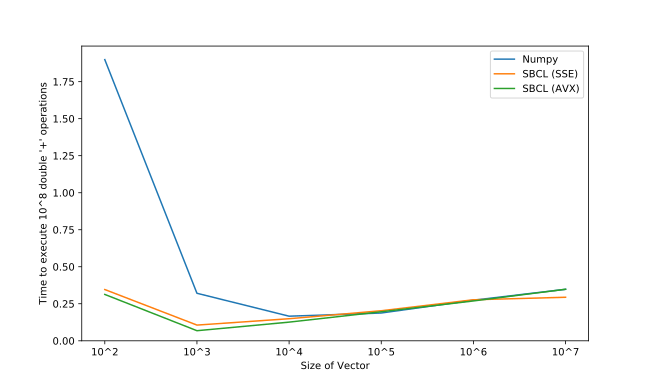
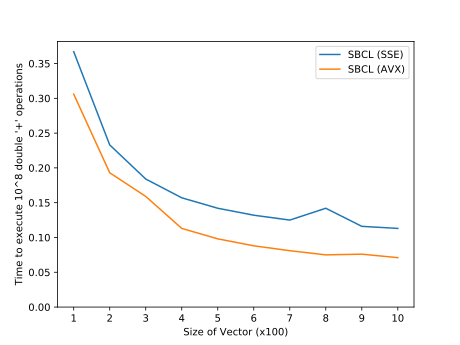
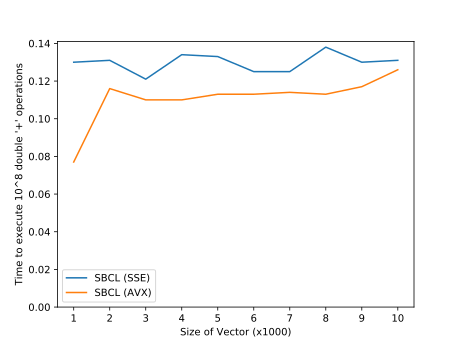
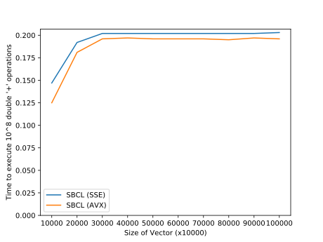

# sbcl-numericals

## Background

Curiosity got the better of me one day, and I set out to explore the limits of numerical computing with Common Lisp. I mean - what does speed require? Just memory-locality and SIMD?
SBCL has memory-locality. What about SIMD? Well, the functionality hasn't been "standardized" yet, and there are several attempts. Indeed, 
SBCL needs more documentation - think Emacs! But knowledge exists in people's heads. People are willing to share it. So, this was possible. 

PS: This library began as a [reddit post](https://www.reddit.com/r/lisp/comments/fkfgjn/sbcl_with_simd_how_to_optimize_sseavx2_to_pointer/), that, in turn, was triggered by [this reddit post](https://www.reddit.com/r/lisp/comments/fjmm6y/deep_learning_with_gpus/).

This should work with the latest [SBCL (get from git)](https://github.com/sbcl/sbcl); there was [a bug with AVX2 even as recently as SBCL 2.0.3](https://www.reddit.com/r/lisp/comments/fsbbqe/sbcl_with_simd_dpps_vs_vdpps_simd_dot_product/). The build is fairly easy: `sh make.sh && sh run-sbcl.sh # or install.sh`.

## So far...

Currently, we only have the operations `s+ s- s* s/` working on single float simple array,
and the corresponding `d+ d- d* d/` working on double float simple arrays; all using
AVX instructions.

In addition, there are the SSE instructions `s2+ s2- s2* s2/` and `d2+ d2- d2* d2/`.

## How does this compare to other numerical libraries?

For one, we are currently very limited in features. For the full realm of possibilities, see [Introduction
to Intel Advanced Vector Extensions](https://software.intel.com/en-us/articles/introduction-to-intel-advanced-vector-extensions).

Because numpy still uses SSE, and we are using AVX, we did expect to be less than twice as fast.

It turns out that for small arrays and large loops, python stands as the bottleneck. The equivalent using AVX in SBCL is about 50% faster than SSE in SBCL. Both outperform python.

For larger arrays, as can be read by searching for "sse vs avx performance boost" on the
web, the performance boost is only obtainable if memory is not the bottleneck (= your arrays
fit in the cache).

The performance benefits also differ from one operation to another. Certain AVX operations carry a larger latency, thus eliminating any performance boost arising out of additional parallelism.

Addition is probably the best case scenario below.

#### Comparing Numpy with SBCL (for addition)

#### Comparing AVX with SSE 

*The following plots can be generated by using code-snippets from the [benchmark](./benchmark) 
directory.*

## Acknowledgements

- Everyone who has contributed to SBCL.
- [u/love5an](https://www.reddit.com/user/love5an/) and [u/neil-lindquist](https://www.reddit.com/user/neil-lindquist/) for the required hand-holding and the [gist](https://gist.github.com/Lovesan/660866b96a2632b900359333a251cc1c).
  - Paul Khuong for [some](https://pvk.ca/Blog/2013/06/05/fresh-in-sbcl-1-dot-1-8-sse-intrinsics/) [blog posts](https://pvk.ca/Blog/2014/08/16/how-to-define-new-intrinsics-in-sbcl/).
- [guicho271828](https://github.com/guicho271828) for attempting an [SBCL Wiki](https://github.com/guicho271828/sbcl-wiki/wiki).
- It's possible that I could have forgotten to mention somebody - so... yeah... happy number crunching!

